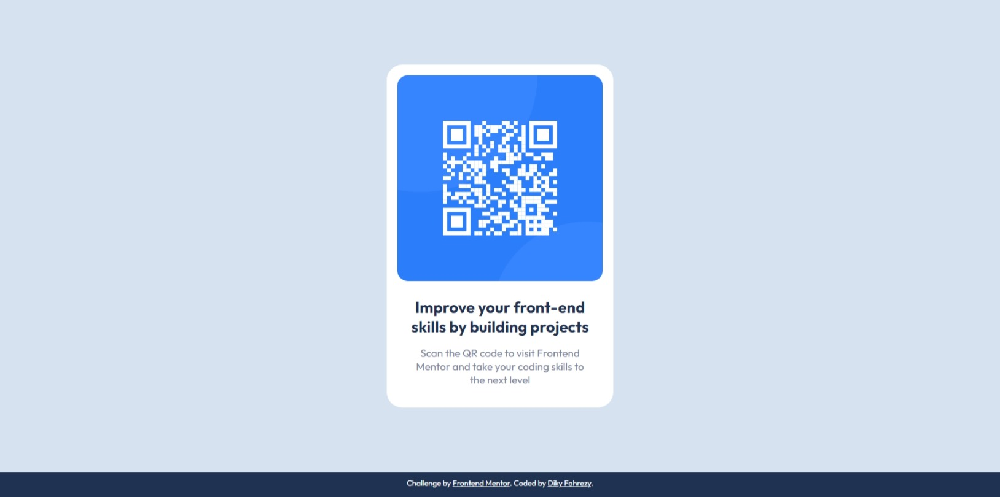

# Frontend Mentor - QR code component solution

This is a solution to the [QR code component challenge on Frontend Mentor](https://www.frontendmentor.io/challenges/qr-code-component-iux_sIO_H). Frontend Mentor challenges help you improve your coding skills by building realistic projects.

## Table of contents

- [Overview](#overview)
  - [Screenshot](#screenshot)
  - [Links](#links)
- [My process](#my-process)
  - [Built with](#built-with)
  - [What I learned](#what-i-learned)
- [Author](#author)

## Overview

### Screenshot



### Links

- Solution URL: [Add solution URL here](https://your-solution-url.com)
- Live Site URL: [Add live site URL here](https://your-live-site-url.com)

## My process

### Built with

- Semantic HTML5 markup
- CSS
- Flexbox
- Mobile-first workflow

### What I learned

Sedikit tricky untuk mengatasi lebar konten yang sama dari versi mobile dengan versi desktop. disini hanya membutuhkan property css berupa max-width tanpa perlu menggunakan media query untuk ukuran layar yang responsif.
It's a little tricky to deal with the same content width of the mobile version as the desktop version. here you only need a CSS property in the form of max-width without the need to use media queries for responsive screen sizes.

```html
<main>
  
  <div class="description">
    <p class="header">Improve your front-end skills by building projects</p>
    <p class="paragraph">Scan the QR code to visit Frontend Mentor and take your coding skills to the next level</p>
  </div>
</main>
```

```css
main {
  max-width: 325px;
}
```

## Author

- Website - [Diky Fahrezy](https://www.dikyfahrezy.github.io)
- Frontend Mentor - [@dikyfahrezy](https://www.frontendmentor.io/profile/dikyfahrezy)
